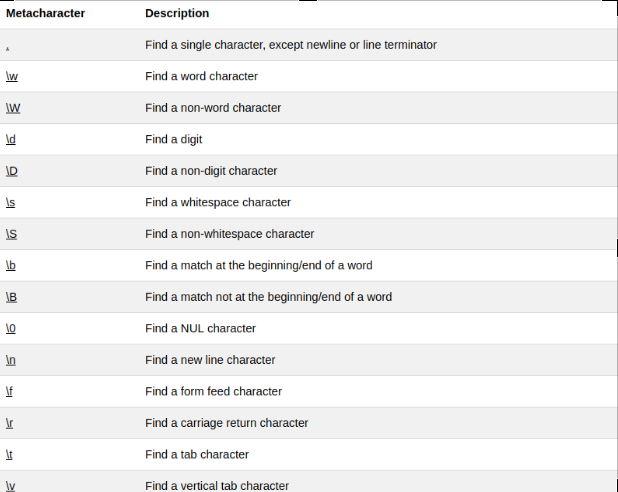

# RegularExpressions
## A regular expression (regex or regexp for short) is a special text string for describing a search pattern.

> Regular expressions are used to find certain words or patterns inside of strings.
For example, if we wanted to find the word the in the string The dog chased the cat, we could use the following regular expression: ` /the/gi`

Let's break this down a bit:

 `/` is the start of the regular expression.

 `the` is the pattern we want to match.

 `/` is the end of the regular expression.

 `g` Global search:means global, which causes the pattern to return all matches in the string, not just the first one.

 `i` Case-insensitive search: means that we want to ignore the case (uppercase or lowercase) when searching for the pattern. 

 `^`  not match : it matches anything that is not enclosed in the brackets


`[a-z]`range small letters
`[A-Z]`range capital letters
`[0-9]`range numbers
`+` used for repetition
`[0-9a-z]` double range



# code
```
[a-z0-9][-a-z0-9+.]*[a-z0-9]@[a-z0-9][-a-z0-9+.?]*[a-z0-9].\w+

```

[Online Test](https://regex101.com/)

##email Test


> us3r1@foundersandcoders.com
us.3r1@foundersandcoders.com
us._3r1@founder?sandcod-ers.com
